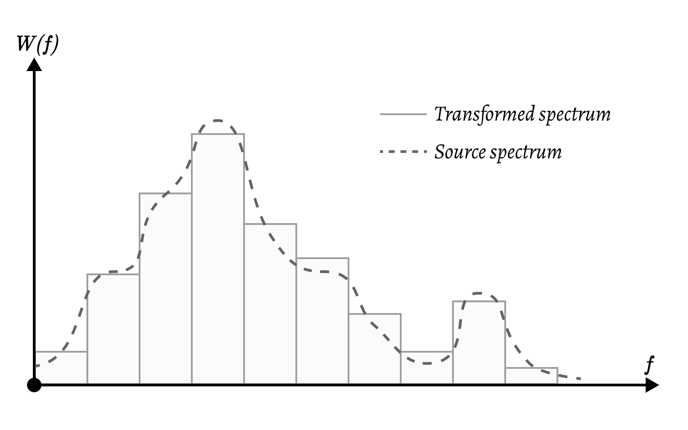

# BandPass Vocoder

Welcome to the spectral vocoder repository!

This repository contains a research file that explores the use of a spectral vocoder to manipulate audio signals. A spectral vocoder is a type of algorithm that can analyze and modify the spectrum of an audio signal, effectively allowing the user transfer less data over the transmission channel.

## Run

To run the code in this repository, you will need to have the following dependencies installed:

- IPython
- Jupyter
- NumPy

To run the code, simply open the Jupyter notebook and follow the instructions provided. There are 3 audio samples in subfolders. Using command you can copy any of this or your own sample at `./a.wav` path which will be picked up by script.

Audio could be `8000Hz 8-bit 1 channel`, but you can play in order to have different.

We hope that this repository will be useful for researchers and developers interested in using spectral vocoders for audio manipulation and analysis. If you have any questions or suggestions, please feel free to open an issue on the repository page.

